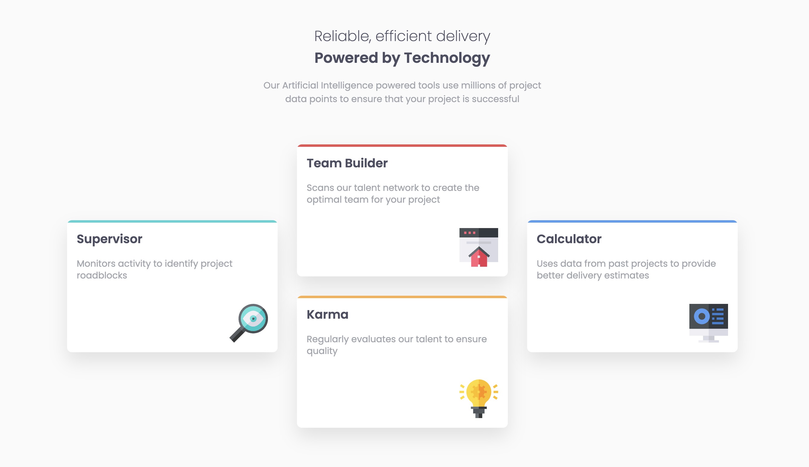

# Frontend Mentor - Four card feature section solution

This is a solution to the [Four card feature section challenge on Frontend Mentor](https://www.frontendmentor.io/challenges/four-card-feature-section-weK1eFYK). Frontend Mentor challenges help you improve your coding skills by building realistic projects.

## Table of contents

- [Overview](#overview)
  - [The challenge](#the-challenge)
  - [Screenshot](#screenshot)
  - [Links](#links)
- [My process](#my-process)
  - [Built with](#built-with)
  - [What I learned](#what-i-learned)
  - [Continued development](#continued-development)
  - [Useful resources](#useful-resources)
- [Author](#author)
- [Acknowledgments](#acknowledgments)

## Overview

### The challenge

Users should be able to:

- View the optimal layout for the site depending on their device's screen size

### Screenshot



### Links

- [Solution URL](https://github.com/lgwarda/four-card-feature-section.git)
- [Live site URL](https://lgwarda.github.io/four-card-feature-section/)

## My process

### Built with

- Semantic HTML5 markup
- CSS CUBE methodology
- CSS Grid
- Mobile-first workflow
- [Sass](https://sass-lang.com/) - CSS preprocessor

### What I learned

#### 1. Using Sass for Better Maintainability and Flexibility

- Sass allows me to write cleaner and more maintainable CSS, with features like variables, nested rules, and mixins.
- The @use directive replaces @import, providing better scope management and avoiding variable conflicts between files.
- Using Sass maps is a powerful way to manage collections of related data, such as breakpoints and colors.

**Example Code:**

```scss
// _colors.scss
$colors: (
  "primary": (
    "red": hsl(0, 78%, 62%),
    "cyan": hsl(180, 62%, 55%),
    "orange": hsl(34, 97%, 64%),
    "blue": hsl(212, 86%, 64%),
  ),
  "neutral": (
    "very-dark-blue": hsl(234, 12%, 34%),
    "grayish-blue": hsl(229, 6%, 66%),
    "very-light-gray": hsl(0, 0%, 98%),
  ),
);

// _sizes.scss
$breakpoints: (
  "sm": 23.4375em,
  // 375px
  "md": 48em,
  // 768px
  "lg": 90em // 1440px,,,,,,,,,,,,
);
```

**Why It’s Important:**

The @use syntax prevents conflicts between variables and functions, and it's easier to manage with larger projects. By using Sass maps, I can easily reference breakpoints and color schemes without hardcoding them

#### 2. Creating Responsive Layouts with CSS Grid

- CSS Grid is incredibly powerful for building complex layouts without needing to rely on floats or positioning hacks.
- Media queries allow me to conditionally apply styles based on viewport size, making it easier to create responsive designs.

**Example Code:**

```scss
.feature-grid {
  display: grid;
  gap: 2rem;
  width: min(100%, 69.375rem);
  margin-inline: auto;
  padding-inline: 2rem;

  @media (min-width: map-get($breakpoints, "md")) {
    grid-template-columns: repeat(3, 1fr);
    grid-template-rows: repeat(4, auto);
    align-items: center;

    .feature-card--supervisor {
      grid-column: 1;
      grid-row: 2 / 4;
    }
  }
}
```

**Why It’s Important:**

Using CSS Grid with grid-template-columns and grid-template-rows makes it much easier to create complex layouts that automatically adjust based on screen size. The use of min() in width: min(100%, 69.375rem); ensures the layout doesn't exceed a maximum width but still scales with smaller screens.

### Continued development

#### 1. Mastering CSS Grid and Flexbox

While I’ve learned to use CSS Grid to create complex, responsive layouts, I still want to explore more advanced features like grid areas and auto-placement to understand how to optimize layouts even further.
I'd also like to become more proficient with Flexbox, especially for layout patterns that don’t require grid, like vertically and horizontally centering content, and using Flexbox for simpler two-dimensional layouts.

How I Will Improve:

- Experiment with Nested Grids: I want to try using nested grids within a parent grid to see how I can combine these two powerful layout techniques for more flexible and complex designs.
- Refining Flexbox Layouts: I will create more project-based exercises that involve creating various component layouts using Flexbox, especially for things like navigation bars and card layouts.

How I Will Improve:

- Create Reusable Mixins: I want to practice building more advanced mixins for common tasks like responsive typography or managing box shadows and transitions.
- Refine Functions for Dynamic Styles: I will experiment with functions that dynamically calculate values like color contrasts or spacing based on user input or media queries.

##### 2. Sass Advanced Features: Mixins and Functions

What I Want to Focus On:

I’ve used Sass maps and variables in this project, but I want to dive deeper into mixins and functions.
Mixins allow you to reuse chunks of CSS, which can make your stylesheets more efficient, while functions allow you to calculate or return values dynamically.

### Useful resources

- [Build a dashboard with CUBE CSS](https://piccalil.li/blog/build-a-dashboard-with-cube-css/) - This article helps me to structure my project in a more maintainable and modular way. I found this methodology particularly effective, and I plan to use it in future projects for its scalability and organization

## Author

- Frontend Mentor - [@lgwarda](https://www.frontendmentor.io/lgwarda/)

## Acknowledgments

I’d like to give a big thank you to the community and resources that continue to inspire and push me to refine my skills, especially those who contributed to articles, tutorials, and discussions that helped me solve tricky problems.
